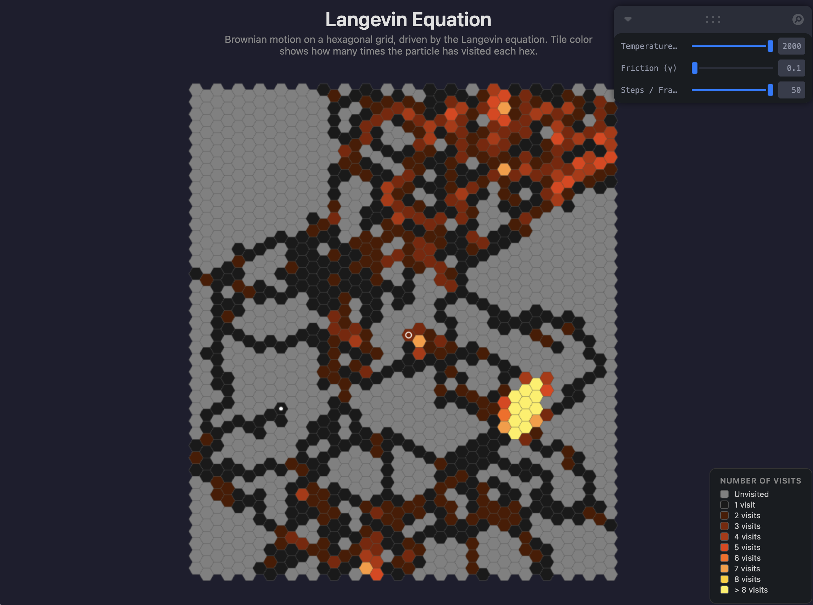

# Langevin Equation

[Live Demo](http://alexeidarmin.com/langevin-equation/)

Brownian motion simulation on a hexagonal tile grid, driven by the Langevin equation. A single particle traverses flat-top hex tiles, and each tile's color reflects how many times the particle has visited it — progressing from gray through dark, red, orange, and yellow as the visit count increases.

